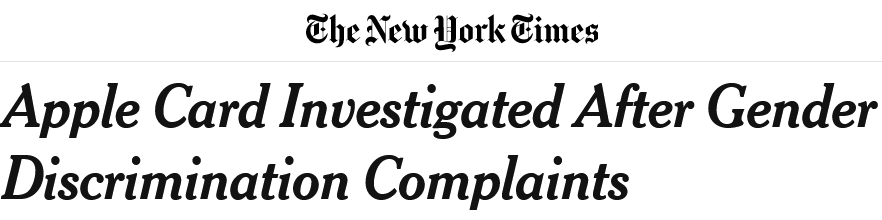

This is the first in a series of articles on ethical AI in business:
1. AI forces us to make explicit ethical decisions, and that's hard in a business
2. Maths and ethics don't mix nicely
3. It's hard to scale ethical discussions
4. Sometimes AI isn't the problem - the product is the problem.

The New York Times test: would you be happy to see your name on the NYT next to your justification of a decision that you made? This is a test for business decision-making that my mum passed on to me from her experience in corporate work. It's appealing, foregoing rigorous conceptual definitions of ethics in favour of simply forcing you to reflect on how you would feel about your decisions appearing outside the corporate bubble.

However, what do you do when the topic you're talking about is so technical that the editor of the NYT would revile in horror at the thought of trying to break it down for the average Jane, let alone fitting mathematical equations in a broadsheet column? What if making a decision on the topic would amount to making a quantitatively measurable and explicit definition of discrimination?

This article seeks to outline 4 key issues to consider in making ethical AI happen in business (or, in academic-speak, 'operationalising' the concepts of ethical AI), from my experience as a data scientist working in this area.

There has been a great deal of public interest in the ethics of AI, following a number of high-profile scandals that have affected every big-name tech company (amazon hiring, google gorilla, facebook genocide/elections, apple card pay, netflix hyper-targeting)

As a result, everyone now wants to get involved in ethical AI. Oodles of research literature are getting cranked out by the machine that is ML academia, now that 'ethics'+'machine learning' = 'publish'. Several research groups have been established: see the links at the bottom of the page.

There are plenty of conceptual difficulties to consider. However, I think the focus of research on methods rather than systems, and maths over humans, is flawed. Ultimately, it is companies, governments, and other organisations that produce AI systems. It's pointless *knowing* that training on balanced datasets leads to more equitable image recognition, if these organisations are not equipped or incentivised to act on that knowledge - especially if training on imbalanced datasets may be easier, and even lead to better accuracy on wealthier customers.

Why am \*I\* talking about this? Good question! At the bottom of this post there is a collection of articles and books which have either informed my view or which I'm aiming to read. These are written by researchers with far more perceptiveness and experience than I could ever hope for. Centering the contributions of a) members of those communities most affected by AI bias, and b) researchers from outside data science are key components to the solution - so please check out those groups and individuals!

Nonetheless, I have been involved in the operationalisation of ethics in machine learning in two capacities at CBA: firstly in AI Labs, contributing towards capability to detect unwanted biases, and now in the Financial Wellbeing Team, investigating the relationship between financial vulnerability and changes in behaviours.

This relatively unique experience, paired with a reasonably interdisciplinary background, has led to some interesting insights over the last year and a half, which I hope to share below.

### Gender bias in healthcare
In 2019 [Babylon Health was accused of gender bias](https://www.babylonhealth.com/blog/tech/doctors-sex-and-the-ai-debate) when its AI-driven health guidance app predicted that a woman presenting with chest pain was having a panic attack, but a man with the same symptoms and other characteristics was predicted to have a heart attack. This seems fairly open-and-shut, especially in the context of women dying because of doctors ignoring their pain. But there's actually three factors that make this really complicated.

*Problems with counterfactual fairness*: Women compared to men at that age have twice the risk of mental health issues, and lower risk of heart conditions. In this case, a simple counterfactual comparison, where you change one variable, is perhaps not appropriate. The fact that gender has a meaningful difference in the outcome of an AI's decision isn't always a bad thing!

*Choosing 'the right' accuracy metric*: From the perspective of an ML algorithm, that was likely the correct decision if you use a metric such as accuracy. However, the consequences of inaccuracy is different in different scenarios. For example, consider the difference between:
- telling someone that they're having a heart attack when they're having a panic attack: now they're even more panicky
- telling someone that they're having a panic attack when they're having a heart attack: now they're dying

How do you construct a metric for your ML algorithm which takes all this into consideration? Where do you draw the line between sending everyone with upper body pain off to the hospital, and only doing so if they are face-down on the floor? 

*Algorithmic bias reflecting bias in society*: Thirdly, what if your data itself is compromised? Medical research is famously biased against women, and women have been historically under-represented as subjects of studies. This prompts three questions:
1. There are some obvious cures to this, such as finding and training on representative datasets. But what if it just doesn't exist? Does a company providing health advice have an ethical obligation to develop medical research?
2. How do you disentangle the *additional* bias created by your algorithm, from that present in your data? Where is the line in the sand which determines what sources of bias a company is responsible for?
3. In cases where it is extremely difficulty to eliminate bias, such as when minority populations are barely represented in the data, is it preferable to produce a worse AI, or no AI?

## People have always discriminated. Now it's explicit.

The purpose of ML and data science *is* to discriminate, in the sense of making a choice. Algorithms are designed to make decisions based on data: 
- send ad or not
- approve for loan or not
- cat or not

However, discrimination, aside from its literal meaning, has a negative connotation. A decision or action is discriminatory if that decision or action is made in a particular way which negatively and unfairly affects someone - often along axes of oppression such as race and gender.

However, people have been making decisions for a long time. Before AI existed, people sent ads, approved loans, and decided whether someone is a criminal. The system for deciding whether these decisions and actions were discriminatory is huge and complex, including discussions between ordinary people, our judicial and political systems, and social customs.

The first key change that ethical AI has brought is that decisions about what constitutes discrimination are complex and *explicit*, as opposed to the usual discussion, which is complex but *implicit*. In the words of [this great HBR article](https://hbr.org/2019/11/how-machine-learning-pushes-us-to-define-fairness), 'machine learning pushes us to define fairness'.

Before, we trusted people (perhaps not wisely) to make complex ethical decisions. There are two characteristics of such human decision-making relevant to our discussion:
1. The ethical decision is *subconscious*, often relying on a mixture of emotion and background psychological processes, and very rarely based on logical reasoning.
2. The ethical decision is made *privately*. This is primarily because it occurs in someone's head, which we do not have access to.

Because this is such a complicated and mysterious process, we have long relied on secondary evidence to decide whether a decision is disciminatory, rather than direct analysis of the decision-making process itself.

Consider a situation where a recruiter is accused of rejecting a candidate due to racial discrimination. The thoughts inside the recruiter's head, and the model and process that they used is essentially hidden.

How, then, could this be classified as discrimination? Note that I'm not containing this to legal definitions of discrimination. From what I can see, this secondary evidence has generally taken three forms: behaviour, explanations, and intentions. 

- *Behaviour*: if the recruiter said a racial slur during the interview, that might well be good evidence that their reasoning was discriminatory.
- *Explanations*: while we can't access their mental reasoning, their written or otherwise recorded justifications might be convincing evidence either way.
- *Intentions*: maybe the situation is more complicated and, for example, requiring 4+ years of experience shuts out female software engineers due to historical imbalances. Nonetheless, 'good intentions' often excuse policies that would otherwise amount to indirect discrimination.

How well do these processes translate to an AI system?
- *Behaviour*: a computer doesn't smirk as it shuts out a minority from a role.
- *Explanations*: this has been a surprisingly popular area, with 'explainable AI' promising a new ability to trust AI. Nonetheless, I think that at best this can deliver a *simalcrum* of an explanation: percentage probabilities for the 'weight' each factor had, which may or may not translate to the actual 'reasoning' the AI used. [This excellent article by the head of decision intelligence at Google](https://medium.com/hackernoon/explainable-ai-wont-deliver-here-s-why-6738f54216be) describes the limitations faced by XAI. The simplest one is: if we could truly explain an AI's decision, we wouldn't need an AI - we could just use the simpler model given by the explanations.
- *Intentions*: since we can simulate the choices made by an AI on a sample population to see empirically if it is discriminatory, it's not so easy to hide behind good intentions anymore.

While we may never know how the actual black box algorithm works, we can measure very well all the ethical consequences of making different algorithm design choices. In a sense, unless a programmer deliberately programs an AI with a clause to the effect of 'if ___, reject', no AI is maliciously discriminatory.

Instead, when we create an AI system to make a decision, the decision-making process is *engineered*, and ethical decisions and trade-offs need to be explicitly made. 

Returning to the AI alternative to our earlier example, we know exactly how discriminatory an AI recruitment tool is according to a million different metrics, and a question such as 'should we optimise for representation across social classes, at the cost of more representation of women?' is either explicitly made during design, or explicitly uncovered in an anti-discrimination lawsuit.

## Some obstructions for businesses

### need to make explicit ethical decisions in a business contexts

And there's a lot of hard questions to answer:
- Are there valid business reasons that certain groups are 'discriminated against' in the data? What constitutes a valid business reason?
- Are you willing to undergo costs beyond that which is required by law? Are you happy to effectively reduce accuracy for privileged groups, just to reduce the accuracy gap? Alternatively, if you can now put a literal dollar value (say $200k) on collecting more data to achieve accuracy parity, when would that cost be too high?
- Is it acceptable to use an entirely different model for a subpopulation? Would that count as being disciminatory in a different fashion (e.g., using a different model for a minority group that, due to the different dataset, performs worse on women)?
- When is there too much bias for a product to go to market?

Those are all decisions that need to be made. If a senior manager isn't making them explicitly, a data scientist somewhere is making those decisions for them - more on the organisational consequences in this post [add hyperlink when written]. 

### need to be very clear about why you care about ethical AI

Because these design trade-offs are now explicit, they have to be decided upon with reference to the big question: "Why does your organisation care about ethical AI?" Hopefully it's not just because it's currently a buzzword and Stanford now has a research group with a nice logo. Is it a desire to:
- avoid bad press,
- meet legal responsibilities,
- do what's right by consumers, or
- specifically address and right issues faced by those previously and/or currently oppressed in society?

Before AI, ethical decisions could be made with reference to the company's purpose statement, loosely tied to it with the promise that good intentions were enough. Now, a statement of purpose needs to be applied into a questions such as: is a 5% accuracy difference between Indigenous Australians and white people for our model ok? What if it's a 30% gap in regional areas? And what if the non-AI alternative has no similarly measurable accuracy difference, but is likely to be worse? 

## Opportunities created by ethical AI

### conservative
The ethical decision is *conservative* in two senses. Firstly, a common justification is 'this is a tricky ethical issue, but everyone else does this'. Secondly, in the presence of uncertainty and complexity, people revert to the standard that they're used to.

### finally talking about tradeoffs
For the first time in history, we're being forced to talk about what it means to be biased and fair in a way that explicitly recognises the tradeoffs between different aspects of these concepts - which I think is a great step forward from the intellectual sloppiness of relying on people's post-facto justifications.

### can't rely on good intentions and justification

Slight tangent: I think that this moral status of post-facto justification is especially silly in the legal profession, in which we pretend that the careful legal reasoning that judges write down in their judgement correspond to the thoughts in their head when they made the judgement - especially given the evidence that some judges' [values are not consistent with their judgements](https://www.smh.com.au/politics/federal/dirty-dyson-former-judge-heydon-s-nickname-at-oxford-amid-fresh-harassment-claims-20200623-p555df.html), or that they are [more lenient after having eaten lunch](https://www.theguardian.com/law/2011/apr/11/judges-lenient-break).

In short, I think it's great that ML is giving us an opportunity to move away from relying on secondary evidence of discriminatory behaviour, or on justications and paper trails for decisions that bear little similarity to the actual decision-making process. At the same time, we need to develop the institutional machinery to start making these explicit decisions without being scared of finally being precise about what it means to be fair.

Good posts:

[Contradictions between principles and practice](https://ethicalai.ai/2020/07/14/principles-versus-practice/)

[Ali Alkhatib's essay on the problem with ethics researchers bowing to the powers that be](https://ali-alkhatib.com/blog/anthropological-intelligence)

Resources:

articles that I've liked:
that one from mit
alkathib's essay

books:
algorithms of oppression
weapons of math destruction
made by humans

International groups:
black in AI
fast.ai
[AI Now Institute](https://ainowinstitute.org/)
stanford centre

[there](https://www.theguardian.com/technology/2019/apr/04/google-ai-ethics-council-backlash) [are]

Australian groups:
3ai
gradient institute

